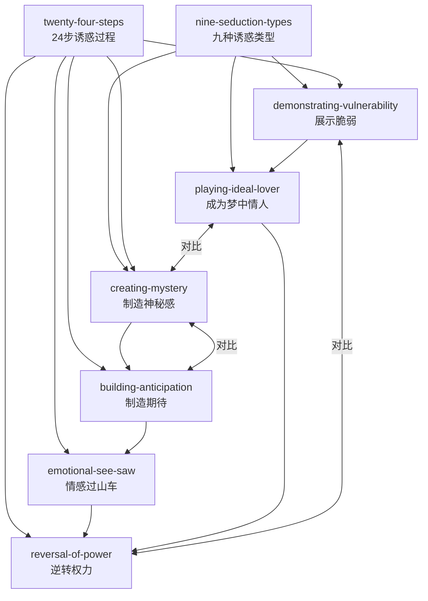

# 诱惑的艺术 (The Art of Seduction)

**作者**: 罗伯特·格林 (Robert Greene)  
**技能数**: 8  
**状态**: ✅ 完成

## 技能列表

| 技能名称 | 一句话描述 |
|---------|-----------|
| nine-seduction-types | 9种诱惑者类型：妖女、浪子、梦中情人、幻性情人、天真情人等 |
| creating-mystery | 神秘感是持久吸引力的核心，不要完全展示自己 |
| building-anticipation | 通过延迟满足和制造期待来增强吸引力 |
| emotional-see-saw | 通过交替给予和收回，制造情感的起伏 |
| demonstrating-vulnerability | 展示弱点和牺牲可以建立信任，让人感觉被选中 |
| reversal-of-power | 逆转追逐关系，从猎人变成猎物 |
| playing-ideal-lover | 成为对方的"梦中情人"，填补他们生命中的缺憾 |
| twenty-four-steps | 诱惑是一个分24步进行的心理过程：基础→深入→征服 |

## Mermaid关系图



## 推荐学习路径

### 路径一：新手入门（按学习顺序）
```
1. nine-seduction-types → 了解9种诱惑者类型，找到自己的定位
2. creating-mystery → 学会制造神秘感
3. building-anticipation → 掌握延迟满足
4. emotional-see-saw → 学会情感过山车
5. demonstrating-vulnerability → 学会展示脆弱
6. playing-ideal-lover → 成为梦中情人
7. reversal-of-power → 逆转追逐关系
8. twenty-four-steps → 理解完整的诱惑过程
```

### 路径二：技能分类

| 分类 | 技能 |
|------|------|
| **类型识别** | nine-seduction-types |
| **吸引力策略** | creating-mystery, building-anticipation, emotional-see-saw |
| **信任建立** | demonstrating-vulnerability, playing-ideal-lover |
| **权力逆转** | reversal-of-power |
| **完整过程** | twenty-four-steps |

## 核心概念

- **九种诱惑类型**: 妖女、浪子、梦中情人、幻性情人、天真情人、挑逗者、魔力大师、魅力领袖、气质明星
- **神秘感**: 不完全展示，保持模糊和不可预测
- **制造期待**: 出现-消失-出现，让对方渴望你回来
- **情感过山车**: 给予-收回-再给予，形成情绪波动
- **逆转追逐**: 从猎人变成猎物，让对方主动追求你

## 九种诱惑者类型详解

| 类型 | 核心策略 | 适用场景 |
|------|---------|---------|
| 妖女 (Siren) | 性魅力+戏剧性+神秘感 | 追求新鲜刺激的对象 |
| 浪子 (Rake) | 危险激情+越禁诱惑 | 受压抑的保守对象 |
| 梦中情人 (Ideal Lover) | 填补缺憾+满足幻想 | 情感空虚的对象 |
| 幻性情人 (Androgyne) | 性别暧昧+打破期待 | 追求独特的对象 |
| 天真情人 (Naif) | 纯真+不设防 | 强势但孤独的对象 |
| 挑逗者 (Dandy) | 热力+淡定反差 | 喜欢挑战的对象 |
| 魔力大师 (Charmer) | 亲切感+无威胁性 | 需要安全感的对象 |
| 魅力领袖 (Charismatic) | 自信+掌控气场 | 渴望被引领的对象 |
| 气质明星 (Star) | 神秘光环+飘渺难测 | 崇拜偶像的对象 |

## 24步诱惑过程三阶段

### 第一阶段：基础阶段 (1-6步)
建立吸引，策略性接近目标

### 第二阶段：深入阶段 (7-15步)
深度渗透，制造依赖和隔离

### 第三阶段：征服阶段 (16-24步)
最终突破，小心事后余波
