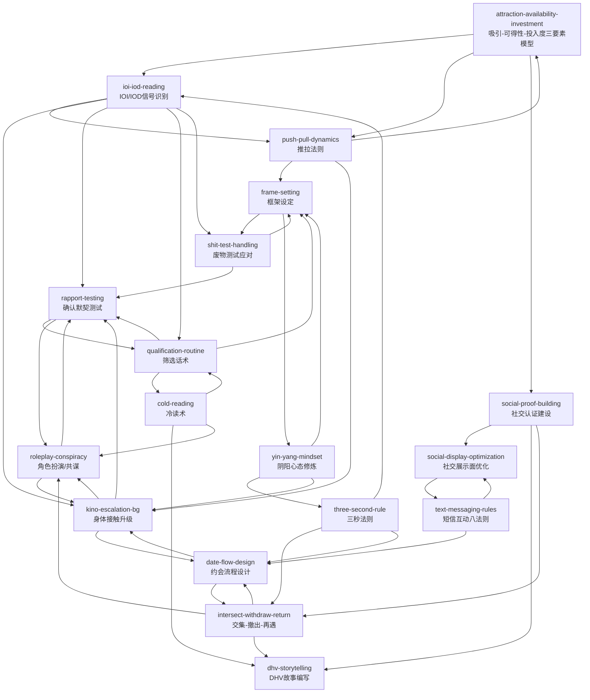

# 野兽绅士 (Beast Gentleman) - 技能索引

> 作者：巫家民（Tango）  
> 技能数量：18  
> 状态：✅ 完成

---

## 技能列表

| # | 技能Slug | 名称 | 核心方法论 |
|---|----------|------|-----------|
| 1 | attraction-availability-investment | 吸引-可得性-投入度三要素模型 | #1 核心理论 |
| 2 | three-second-rule | 三秒法则+搭讪焦虑管理 | #4 行动前提 |
| 3 | ioi-iod-reading | IOI/IOD信号识别系统 | #2 互动核心 |
| 4 | push-pull-dynamics | 推拉法则/话术 | #3 互动核心 |
| 5 | social-proof-building | 社交认证建设 | #5 展示技术 |
| 6 | cold-reading | 冷读术应用 | #6 展示技术 |
| 7 | shit-test-handling | 废物测试应对（三不原则） | #7 博弈层 |
| 8 | frame-setting | 框架设定/控制 | #8 博弈层 |
| 9 | kino-escalation-bg | 身体接触升级（渐进式） | #9 物理升级 |
| 10 | date-flow-design | 约会流程设计（三阶段十分钟法） | 操作层 |
| 11 | text-messaging-rules | 短信互动八法则 | 操作层 |
| 12 | social-display-optimization | 社交展示面优化 | 线上展示 |
| 13 | dhv-storytelling | DHV故事编写 | 展示技术 |
| 14 | rapport-testing | 确认默契测试 | 默契确认 |
| 15 | yin-yang-mindset | 阴阳心态修炼 | 内在修炼 |
| 16 | intersect-withdraw-return | 交集-撤出-再遇模式 | 进阶模式 |
| 17 | roleplay-conspiracy | 角色扮演/共谋 | 进阶模式 |
| 18 | qualification-routine | 筛选话术（递进式了解） | 筛选技术 |

---

## 技能关系图

---

## 推荐学习路径

### 第一阶段：理论基础（先读）

| 顺序 | 技能 | 理由 |
|------|------|------|
| 1 | attraction-availability-investment | 全书核心理论，理解两性关系三要素 |
| 2 | yin-yang-mindset | 内在心态修炼，建立自信基础 |
| 3 | ioi-iod-reading | 理解信号系统，是所有互动的基础 |

### 第二阶段：开场与搭讪

| 顺序 | 技能 | 理由 |
|------|------|------|
| 4 | three-second-rule | 克服搭讪焦虑，立即行动 |
| 5 | intersect-withdraw-return | 完整搭讪模式：交集→撤出→再遇 |
| 6 | social-proof-building | 建立社交认证，增加搭讪底气 |

### 第三阶段：互动核心

| 顺序 | 技能 | 理由 |
|------|------|------|
| 7 | push-pull-dynamics | 推拉话术，调动女性情绪 |
| 8 | frame-setting | 框架控制，不被带偏 |
| 9 | shit-test-handling | 废物测试应对，保持框架 |

### 第四阶段：展示与价值

| 顺序 | 技能 | 理由 |
|------|------|------|
| 10 | cold-reading | 冷读建立信任 |
| 11 | dhv-storytelling | 故事展示价值 |
| 12 | social-display-optimization | 线上展示面优化 |
| 13 | rapport-testing | 确认默契，验证真假IOI |

### 第五阶段：约会与升级

| 顺序 | 技能 | 理由 |
|------|------|------|
| 14 | date-flow-design | 约会流程设计 |
| 15 | kino-escalation-bg | 身体接触升级 |
| 16 | text-messaging-rules | 短信互动规则 |

### 第六阶段：进阶模式

| 顺序 | 技能 | 理由 |
|------|------|------|
| 17 | roleplay-conspiracy | 角色扮演与共谋 |
| 18 | qualification-routine | 筛选话术 |

---

## 技能分类

### 核心理论 (1)
- **attraction-availability-investment**: 吸引-可得性-投入度三要素模型

### 行动前提 (1)
- **three-second-rule**: 三秒法则

### 互动核心 (2)
- **ioi-iod-reading**: IOI/IOD信号识别
- **push-pull-dynamics**: 推拉法则

### 展示技术 (4)
- **social-proof-building**: 社交认证建设
- **cold-reading**: 冷读术
- **dhv-storytelling**: DHV故事编写
- **social-display-optimization**: 社交展示面优化

### 博弈层 (2)
- **frame-setting**: 框架设定
- **shit-test-handling**: 废物测试应对

### 操作层 (2)
- **date-flow-design**: 约会流程设计
- **text-messaging-rules**: 短信互动八法则

### 物理升级 (1)
- **kino-escalation-bg**: 身体接触升级

### 进阶模式 (2)
- **intersect-withdraw-return**: 交集-撤出-再遇
- **roleplay-conspiracy**: 角色扮演/共谋

### 内在修炼 (1)
- **yin-yang-mindset**: 阴阳心态修炼

### 默契与筛选 (2)
- **rapport-testing**: 确认默契测试
- **qualification-routine**: 筛选话术

---

## 文档信息

- **书籍**: 野兽绅士 (Beast Gentleman)
- **作者**: 巫家民（Tango）
- **来源**: 中国网络小说/PUA教程
- **技能提取**: book2skill 阶段3 Zettelkasten 链接构建器
- **生成时间**: 2026-04-19
