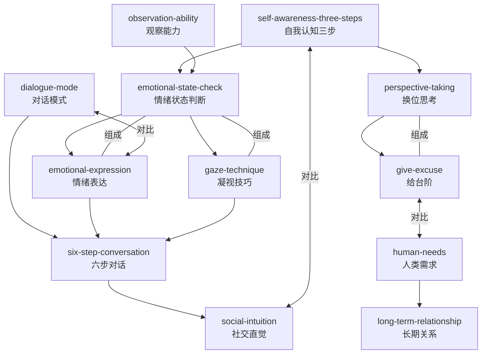

# 情绪流方法论 (Emotional Flow)

**作者**: 损友  
**技能数**: 12  
**状态**: ✅ 完成

## 技能列表

| 技能名称 | 一句话描述 |
|---------|-----------|
| self-awareness-three-steps | 通过"是什么-为什么-怎么做"三层提问认清自己真正的情绪和需求 |
| emotional-state-check | 通过表情、语气、肢体语言判断对方的情绪状态，不依赖对方说什么 |
| gaze-technique | 用"看-停-给"的节奏，让对方感到被关注而不是被审视 |
| dialogue-mode | 根据情绪状态选择不同的对话模式：信息交换型vs情感连接型 |
| emotional-expression | 用"情绪标签+确认+共情"的方式表达情绪，让对方感到被理解 |
| perspective-taking | 能够切换到对方视角看待事物，理解她为什么这么想 |
| six-step-conversation | 六个层次的对话递进，从寒暄到深层次情感连接 |
| human-needs | 理解人类基本的六种情感需求，让情绪互动更有深度 |
| observation-ability | 有意识地训练自己对细节的感知力，从"没注意到"到"注意到并记住" |
| give-excuse | 用"理由-补偿-正向框架"的方式给对方台阶，让她接受你的请求 |
| social-intuition | 综合运用情绪认知、观察、表达，在社交场合中做出恰当的情绪回应 |
| long-term-relationship | 通过"情绪存款"和"理解冲突"来建立长期的情感信任 |

## Mermaid关系图



## 推荐学习路径

### 路径一：新手入门（按学习顺序）
```
1. self-awareness-three-steps → 认清自己的情绪
2. observation-ability → 学会观察细节
3. emotional-state-check → 判断他人情绪
4. gaze-technique → 基础眼神交流
5. dialogue-mode → 选择正确的对话模式
6. emotional-expression → 学会表达自己的情绪
7. perspective-taking → 理解他人的视角
8. six-step-conversation → 深度对话递进
9. human-needs → 理解情感需求
10. give-excuse → 给对方台阶
11. social-intuition → 综合应用
12. long-term-relationship → 长期关系维护
```

### 路径二：技能分类

| 分类 | 技能 |
|------|------|
| **自我认知** | self-awareness-three-steps |
| **观察判断** | observation-ability, emotional-state-check, gaze-technique |
| **对话交流** | dialogue-mode, emotional-expression, six-step-conversation |
| **理解他人** | perspective-taking, human-needs, give-excuse |
| **综合应用** | social-intuition, long-term-relationship |

## 核心概念

- **自我认知三步法**: 是什么情绪→为什么产生→我可以做什么
- **情绪状态判断**: 观察表情、语气、肢体、呼吸四个维度
- **对话模式**: 信息交换型 vs 情感连接型
- **六步对话递进**: 寒暄→事实→观点→感受→需求→秘密
- **人类基本需求**: 被认可、被理解、被尊重、被关注、被接纳、被爱

## 相关技能分类

### 基础技能
- `self-awareness-three-steps`: 认识自己情绪的基础
- `observation-ability`: 观察能力的基础

### 核心技能
- `emotional-state-check`: 判断他人情绪的核心
- `dialogue-mode`: 对话模式的基础
- `emotional-expression`: 情绪表达的基础

### 进阶技能
- `gaze-technique`: 需要情绪状态判断基础
- `perspective-taking`: 需要自我认知和情绪判断基础
- `six-step-conversation`: 需要对话模式和情绪表达基础
- `human-needs`: 需要情绪判断和换位思考基础

### 高级技能
- `give-excuse`: 需要换位思考和人类需求知识
- `social-intuition`: 所有技能的综合应用
- `long-term-relationship`: 需要理解人类需求和情绪表达
