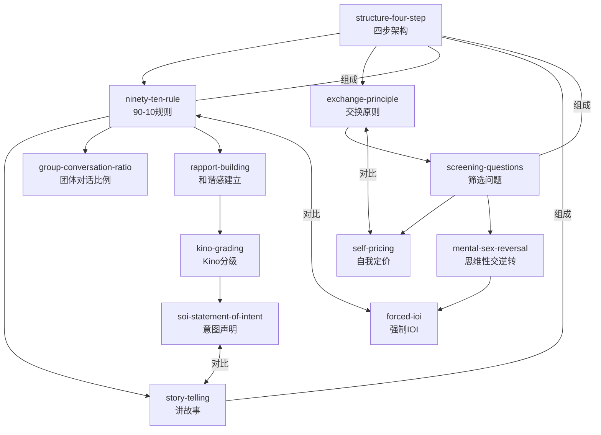

# 杂耍人方法 (Juggler Method)

**作者**: Wayne Elise (杂耍人)  
**技能数**: 12  
**状态**: ✅ 完成

## 技能列表

| 技能名称 | 一句话描述 |
|---------|-----------|
| ninety-ten-rule | 搭讪开始时提供90%以上的谈话内容，避免对话中断 |
| exchange-principle | 不免费付出，通过交换让对方为你的价值付出代价 |
| group-conversation-ratio | 团体搭讪中提供270%以上的谈话内容 |
| structure-four-step | 开场→情绪→筛选→收场的四步架构 |
| story-telling | 讲让她产生画面感的故事，用感官细节和情感起伏让她投入 |
| kino-grading | 用渐进式肢体接触升级亲密感，从手到脸到嘴唇 |
| rapport-building | 用情绪共鸣而不是逻辑说服，让她感觉你们是同类人 |
| forced-ioi | 通过制造"假装她对你有兴趣"的场景，迫使她给你IOI |
| screening-questions | 通过问深层问题筛选她的价值观，而不是表面条件 |
| mental-sex-reversal | 通过"拿走-给予"的推拉技术，让她不确定但更被你吸引 |
| self-pricing | 通过声明你的标准和要求，让她来赢得你的关注 |
| soi-statement-of-intent | 用意图声明让女孩想象和你亲密的场景 |

## Mermaid关系图



## 推荐学习路径

### 路径一：新手入门（按学习顺序）
```
1. structure-four-step → 理解整个搭讪框架
2. ninety-ten-rule → 掌握开场和情绪阶段
3. story-telling → 学习如何讲故事
4. exchange-principle → 理解价值交换
5. rapport-building → 建立情感连接
6. kino-grading → 学会渐进式肢体接触
7. screening-questions → 筛选合适对象
8. self-pricing → 建立自我标准
9. mental-sex-reversal → 掌握推拉技术
10. forced-ioi → 迫使对方表态
11. soi-statement-of-intent → 声明意图
12. group-conversation-ratio → 团体搭讪技巧
```

### 路径二：技能分类

| 分类 | 技能 |
|------|------|
| **开场与框架** | structure-four-step, ninety-ten-rule |
| **情绪与故事** | story-telling, rapport-building, group-conversation-ratio |
| **价值与交换** | exchange-principle, self-pricing, screening-questions |
| **肢体与意图** | kino-grading, soi-statement-of-intent, forced-ioi |
| **推拉技术** | mental-sex-reversal |

## 核心概念

- **90-10规则**: 搭讪开始时你提供90%以上的谈话内容
- **交换原则**: 不给免费午餐，让她为你的价值付出代价
- **Kino分级**: 从手→手腕→手臂→肩膀→腰→头发→脸→嘴唇渐进升级
- **四步架构**: 开场(1分钟)→情绪(10分钟)→筛选(5分钟)→收场

## 相关技能分类

### 基础技能
- `structure-four-step`: 整体框架，所有技能的基础

### 核心技能
- `ninety-ten-rule`: 开场和情绪阶段的核心
- `exchange-principle`: 价值保护机制
- `rapport-building`: 情感连接基础

### 进阶技能
- `kino-grading`: 需要 rapport-building 作为基础
- `screening-questions`: 需要情绪阶段建立后才能使用
- `soi-statement-of-intent`: 需要 Kino 基础

### 高级技能
- `mental-sex-reversal`: 需要筛选能力
- `forced-ioi`: 需要情绪基础
- `self-pricing`: 需要筛选能力
