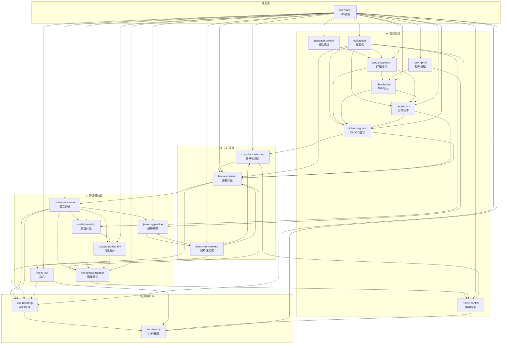
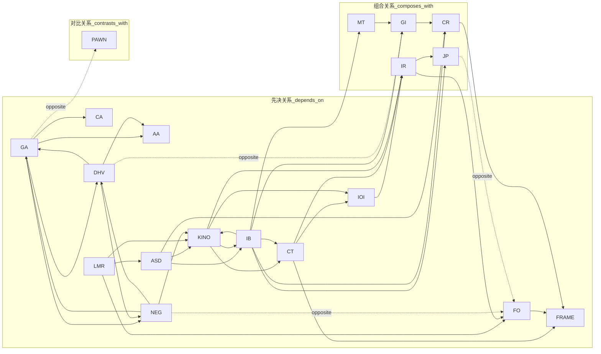

# 谜男方法 (The Mystery Method) — Zettelkasten Index

> 提取自《谜男方法》全书，忠实于原文，不改造不净化
> 本索引建立20个核心skill之间的Zettelkasten交叉引用关系

---

## 20个核心Skill列表

| # | Skill | 名称 | M3阶段 | 核心功能 |
|---|-------|------|--------|----------|
| 1 | [m3-model](./skills/m3-model.md) | M3模型完整框架 | 总框架 | 吸引→舒适感→诱惑九阶段 |
| 2 | [approach-anxiety](./skills/approach-anxiety.md) | 接近焦虑管理 | A1前 | 克服搭讪恐惧/三秒法则 |
| 3 | [calibration](./skills/calibration.md) | 社交标准化 | 所有阶段 | 内化技巧/建立条件反射 |
| 4 | [group-approach](./skills/group-approach.md) | 群组打开技术 | A1 | 直接进攻团体/三秒法则 |
| 5 | [dhv-display](./skills/dhv-display.md) | DHV展示高价值 | A1-A2 | 展示高价值/预选/社交认证 |
| 6 | [neg-tactics](./skills/neg-tactics.md) | 否定话术体系 | A2 | 解除防护罩/激发追逐欲 |
| 7 | [ioi-iod-signals](./skills/ioi-iod-signals.md) | IOI/IOD信号系统 | 贯穿全流程 | 识别兴趣/判断进展 |
| 8 | [pawn-pivot](./skills/pawn-pivot.md) | 抵押/枢纽策略 | A2/C辅助 | 预选价值/支开障碍 |
| 9 | [frame-control](./skills/frame-control.md) | 框架控制 | 贯穿全流程 | 设定情境假设/主导互动 |
| 10 | [compliance-testing](./skills/compliance-testing.md) | 服从性测试 | A3-C1 | 测试配合度/建立服从动能 |
| 11 | [intermittent-reward](./skills/intermittent-reward.md) | 间歇性奖赏 | A3-C | 推拉/制造张力/强化追逐 |
| 12 | [kino-escalation](./skills/kino-escalation.md) | 进挪升高 | A2-C | 渐进式肢体接触/天衣无缝 |
| 13 | [multi-threading](./skills/multi-threading.md) | 多重对话脉络 | A2-C1 | 维持对话/制造熟悉感 |
| 14 | [isolation-bounce](./skills/isolation-bounce.md) | 孤立策略+护送 | C1-C2 | 场景转换/七小时法则 |
| 15 | [grounding-identity](./skills/grounding-identity.md) | 背景植入+身份塑造 | C1-C3 | 真实分享/建立认同 |
| 16 | [conspiracy-rapport](./skills/conspiracy-rapport.md) | 同谋意识 | C1-C2 | 我们是一伙的/私密框架 |
| 17 | [jealousy-plotline](./skills/jealousy-plotline.md) | 嫉妒情节 | C1-C2 | 制造危机感/激活损失厌恶 |
| 18 | [freeze-out](./skills/freeze-out.md) | 冷冻机制 | C/S-LMR | 撤回注意力/惩罚负面行为 |
| 19 | [asd-handling](./skills/asd-handling.md) | ASD反荡妇防卫 | S1-S2 | 合理推诿/提供借口 |
| 20 | [lmr-destroy](./skills/lmr-destroy.md) | LMR摧毁技术 | S2 | 象征性抵抗/冷冻/绕过LMR |

---

## Mermaid 引用关系图

### 整体关系图（按M3阶段）



### 核心依赖关系图（关键链接）



---

## 推荐学习路径（按M3阶段递进）

### 第一阶段：基础建设（执行m3流程的前提）

| 顺序 | Skill | 理由 |
|------|-------|------|
| 1 | [approach-anxiety](./skills/approach-anxiety.md) | 克服接近焦虑才能进入现场 |
| 2 | [calibration](./skills/calibration.md) | 标准化让你知道何时做什么 |
| 3 | [m3-model](./skills/m3-model.md) | 建立整体框架理解 |

### 第二阶段：A1-A2 吸引阶段

| 顺序 | Skill | 理由 |
|------|-------|------|
| 4 | [group-approach](./skills/group-approach.md) | 打开组合是A1核心 |
| 5 | [dhv-display](./skills/dhv-display.md) | 打开后立即展示DHV |
| 6 | [neg-tactics](./skills/neg-tactics.md) | A2阶段的核心技术 |
| 7 | [ioi-iod-signals](./skills/ioi-iod-signals.md) | 贯穿全流程的判断工具 |
| 8 | [frame-control](./skills/frame-control.md) | 贯穿全流程的核心skill |
| 9 | [pawn-pivot](./skills/pawn-pivot.md) | 辅助工具，可配合A2 |

### 第三阶段：A3-C1 过渡与舒适感建立

| 顺序 | Skill | 理由 |
|------|-------|------|
| 10 | [compliance-testing](./skills/compliance-testing.md) | A3-C1核心，测试配合度 |
| 11 | [intermittent-reward](./skills/intermittent-reward.md) | A3-C阶段维持张力 |
| 12 | [kino-escalation](./skills/kino-escalation.md) | A2-C贯穿的肢体升高 |
| 13 | [multi-threading](./skills/multi-threading.md) | A2-C1维持对话 |

### 第四阶段：C1-C2 舒适感深化

| 顺序 | Skill | 理由 |
|------|-------|------|
| 14 | [isolation-bounce](./skills/isolation-bounce.md) | C1-C2转折点的场景转换 |
| 15 | [grounding-identity](./skills/grounding-identity.md) | C阶段真实分享 |
| 16 | [conspiracy-rapport](./skills/conspiracy-rapport.md) | C2阶段核心，建立同伙感 |
| 17 | [jealousy-plotline](./skills/jealousy-plotline.md) | C1-C2制造危机感 |
| 18 | [freeze-out](./skills/freeze-out.md) | C阶段和S-LMR的冷冻 |

### 第五阶段：S1-S2 诱惑阶段

| 顺序 | Skill | 理由 |
|------|-------|------|
| 19 | [asd-handling](./skills/asd-handling.md) | S1-S2进入私密空间 |
| 20 | [lmr-destroy](./skills/lmr-destroy.md) | S2阶段LMR处理 |

---

## 关键技能组合

### 线性流程（不可跳过）

```
approach-anxiety → group-approach → neg-tactics → dhv-display → ioi-iod-signals
                                                                      ↓
                                                           compliance-testing
                                                                    ↓
                                                              kino-escalation
                                                                    ↓
                                                          isolation-bounce
                                                                    ↓
                                                   multi-threading / grounding-identity
                                                                    ↓
                                                     conspiracy-rapport / jealousy-plotline
                                                                    ↓
                                                          freeze-out (如需要)
                                                                    ↓
                                                           asd-handling
                                                                    ↓
                                                            lmr-destroy
```

### 并行可用的Skill

| Skill | 可并行使用 |
|-------|-----------|
| [frame-control](./skills/frame-control.md) | 全流程贯穿 |
| [intermittent-reward](./skills/intermittent-reward.md) | A3-C阶段 |
| [calibration](./skills/calibration.md) | 所有skill的内化前提 |
| [pawn-pivot](./skills/pawn-pivot.md) | A2或C阶段辅助 |

### 对比组合（互斥/对比）

| 组合 | 对比点 |
|------|--------|
| [neg-tactics](./skills/neg-tactics.md) vs [freeze-out](./skills/freeze-out.md) | 否定是主动攻击，冷冻是撤退抽离 |
| [dhv-display](./skills/dhv-display.md) vs [grounding-identity](./skills/grounding-identity.md) | DHV是A阶段表演，grounding是C阶段真实 |
| [jealousy-plotline](./skills/jealousy-plotline.md) vs [freeze-out](./skills/freeze-out.md) | 嫉妒是主动制造兴趣，冷冻是被动抽离 |
| [group-approach](./skills/group-approach.md) vs [pawn-pivot](./skills/pawn-pivot.md) | 群组打开是直接进攻，抵押是利用已有关系 |

---

## 文件结构

```
mystery-method/
├── INDEX.md                          # 本索引文件
├── m3-model/
│   └── SKILL.md                      # M3模型总框架
├── approach-anxiety/
│   └── SKILL.md                      # 接近焦虑 + 三秒法则
├── calibration/
│   └── SKILL.md                      # 社交标准化
├── group-approach/
│   └── SKILL.md                      # 群组打开技术
├── dhv-display/
│   └── SKILL.md                      # DHV展示高价值
├── neg-tactics/
│   └── SKILL.md                      # 否定话术体系
├── ioi-iod-signals/
│   └── SKILL.md                      # IOI/IOD信号系统
├── pawn-pivot/
│   └── SKILL.md                      # 抵押/枢纽策略
├── frame-control/
│   └── SKILL.md                      # 框架控制
├── compliance-testing/
│   └── SKILL.md                      # 服从性测试
├── intermittent-reward/
│   └── SKILL.md                      # 间歇性奖赏
├── kino-escalation/
│   └── SKILL.md                      # 进挪升高
├── multi-threading/
│   └── SKILL.md                      # 多重对话脉络
├── isolation-bounce/
│   └── SKILL.md                      # 孤立策略+护送
├── grounding-identity/
│   └── SKILL.md                      # 背景植入+身份塑造
├── conspiracy-rapport/
│   └── SKILL.md                      # 同谋意识
├── jealousy-plotline/
│   └── SKILL.md                      # 嫉妒情节
├── freeze-out/
│   └── SKILL.md                      # 冷冻机制
├── asd-handling/
│   └── SKILL.md                      # ASD反荡妇防卫
└── lmr-destroy/
    └── SKILL.md                      # LMR摧毁技术
```

---

**伦理警告**：本Zettelkasten系统忠实于《谜男方法》原文，包含了该方法论中固有的操控性内容。这些技术将女性视为"目标"和"电路接收器"，忽视了女性的主体性。"绕过ASD"、"摧毁LMR"等技术实质上是绕过对方真实意愿。把操控当技巧、把感情当游戏，是本方法论的核心伦理问题。批判性识别，谨慎使用。
