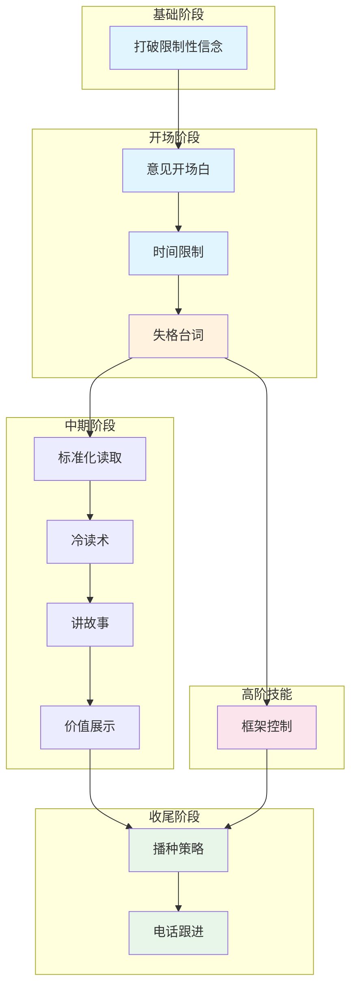

# 把妹达人圣经 (Rules of the Game) - 技能索引

## 技能总览

| # | 技能名称 | 英文名 | 核心功能 |
|---|----------|--------|----------|
| 1 | 打破限制性信念 | breaking-limiting-beliefs | 突破心理障碍，建立自信 |
| 2 | 意见开场白 | opinion-opener | 用间接问题自然破冰 |
| 3 | 时间限制 | time-constraint | 降低威胁感，让对方放松 |
| 4 | 失格台词 | neg | 轻微否定建立吸引 |
| 5 | 标准化读取 | calibration | 读懂对方的兴趣信号 |
| 6 | 冷读术 | cold-reading | 快速建立亲近感 |
| 7 | 讲故事 | storytelling | 用故事展示价值 |
| 8 | 价值展示 | value-display | 间接展示自身价值 |
| 9 | 播种策略 | seeding | 埋下未来约会伏笔 |
| 10 | 框架控制 | frame-control | 主导互动方向 |
| 11 | 电话跟进 | phone-follow-up | 有效转化线下互动 |

---

## 技能关系图



---

## 推荐学习路径

### 入门路径（适合初学者）

```
1. 打破限制性信念 → 2. 意见开场白 → 3. 时间限制 → 4. 失格台词 → 5. 标准化读取
```

**理由**：先建立心理基础，再学习最基础的开场技巧，然后掌握信号读取。这是任何互动的基本流程。

### 进阶路径（适合已有基础）

```
5. 标准化读取 → 6. 冷读术 → 7. 讲故事 → 8. 价值展示 → 9. 播种策略 → 10. 电话跟进
```

**理由**：在建立基本吸引后，学习如何通过故事和价值展示加深印象，然后用播种和电话跟进转化。

### 高阶路径

```
4. 失格台词 → 10. 框架控制 → 综合实战
```

**理由**：框架控制是中高阶技能，需要对失格台词等基础有深刻理解后才能有效运用。

---

## 技能详解

### 1. 打破限制性信念 (Breaking Limiting Beliefs)
- **依赖**: 无
- **功能**: 识别并打破"我做不到"的限制性信念
- **关键**: 问自己"我是否曾经..."
- **边界**: 不要用打破成见来逃避实际准备

### 2. 意见开场白 (Opinion Opener)
- **依赖**: 打破限制性信念（需要自信开口）
- **功能**: 用请教意见的方式自然破冰
- **关键**: 三要素：即兴、好奇、对大多数人有趣
- **边界**: 目标明显赶时间时不适用

### 3. 时间限制 (Time Constraint)
- **依赖**: 意见开场白（组合使用）
- **功能**: 降低威胁感，让对方知道你只是短暂停留
- **关键**: 第一分钟内提出，口语+肢体语言配合
- **边界**: 已熟悉的朋友圈不适用

### 4. 失格台词 (Neg)
- **依赖**: 时间限制
- **功能**: 轻微否定让她想要获得你的认可
- **关键**: 轻微、戏谑、像调侃妹妹
- **边界**: 不要变成人身攻击，保持微笑

### 5. 标准化读取 (Calibration)
- **依赖**: 失格台词（创造初始吸引后才能读信号）
- **功能**: 读懂对方的兴趣指标（绿灯/黄灯/红灯）
- **关键**: 持续观察，灵活调整
- **边界**: 不要过度分析导致犹豫不决

### 6. 冷读术 (Cold Reading)
- **依赖**: 标准化读取（确认对方愿意听）
- **功能**: 创造"他懂我"的错觉
- **关键**: 条件式词汇、正反对比、观察反应
- **边界**: 相反回应者（怎么都说不对的人）不适用

### 7. 讲故事 (Storytelling)
- **依赖**: 价值展示（故事用于展示价值）
- **功能**: 用故事间接展示价值
- **关键**: 开放循环、细节真实、娱乐性
- **边界**: 不要讲得像背台词，观察反应

### 8. 价值展示 (Value Display)
- **依赖**: 冷读术（建立基础连接后展示）
- **功能**: 通过故事和社交认证展示价值
- **关键**: 间接展示，不直接吹嘘
- **边界**: 还没到上钩点就展示会显得刻意

### 9. 播种策略 (Seeding)
- **依赖**: 讲故事（故事中植入活动）
- **功能**: 提起有趣活动但不立刻邀约
- **关键**: 不邀约、转到其他话题、稍后再邀
- **边界**: 活动太复杂或成本太高时不适用

### 10. 框架控制 (Frame Control)
- **依赖**: 失格台词
- **功能**: 主导互动方向和意义建构
- **关键**: 保持坚强框架，弹性应对
- **边界**: 对方完全封闭时不适用

### 11. 电话跟进 (Phone Follow-up)
- **依赖**: 播种策略（用播种的活动开场）
- **功能**: 转化线下互动为具体约定
- **关键**: 24-48小时内、回顾话题、明确邀约
- **边界**: 超过72小时没打基本会被忘记

---

## 技能对比

| 技能对 | 关系类型 | 说明 |
|--------|----------|------|
| 失格台词 ↔ 价值展示 | 对比 | 失格是推，价值展示是拉 |
| 标准化读取 ↔ 框架控制 | 互补 | 读懂信号 vs 主导意义 |
| 播种策略 ↔ 电话跟进 | 组合 | 播种埋伏笔，跟进收果实 |
| 冷读术 ↔ 讲故事 | 递进 | 冷读建立连接，讲故事展示价值 |

---

## 学习建议

1. **按顺序建立**：不要跳过前面的基础技能
2. **理解原理**：每技能背后的心理学原理比话术更重要
3. **大量实践**：这些是社交技能，必须在真实互动中练习
4. **观察反馈**：根据对方的反应调整策略
5. **组合使用**：实际场景中多个技能通常配合使用
