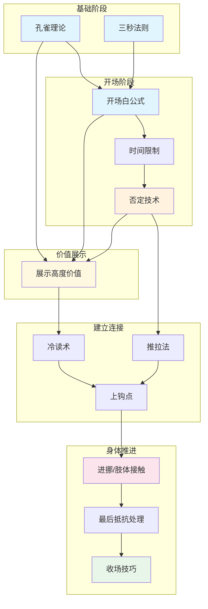

# 把妹达人 (The Game) - 技能索引

## 技能总览

| # | 技能名称 | 英文名 | 核心功能 |
|---|----------|--------|----------|
| 1 | 孔雀理论 | peacock-theory | 用外表在竞争中脱颖而出 |
| 2 | 三秒法则 | three-second-rule | 消除犹豫，立刻行动 |
| 3 | 开场白公式 | opener-formula | 用剧本式话术破冰 |
| 4 | 时间限制 | time-constraint | 解除被推销的焦虑 |
| 5 | 否定技术 | neg-technique | 轻微贬低建立吸引 |
| 6 | 展示高度价值 | DHV-display | 展示自己比周围人更有价值 |
| 7 | 冷读术 | cold-reading | 创造"他懂我"的错觉 |
| 8 | 推拉法 | push-pull | 交替推开拉近制造情绪波动 |
| 9 | 上钩点 | hook-point | 识别她想继续互动的时刻 |
| 10 | 进挪/肢体接触 | kino-touch | 用触碰推进关系 |
| 11 | 最后抵抗处理 | LMR-handling | 应对性行为前的最后抗拒 |
| 12 | 收场技巧 | close-technique | 果断完成亲密行为 |

---

## 技能关系图



---

## 推荐学习路径

### 入门路径（建立基础）

```
1. 孔雀理论 → 2. 三秒法则 → 3. 开场白公式 → 4. 时间限制
```

**理由**：先学会打扮和行动，再学习如何开场。这是所有互动的前提。

### 核心路径（建立吸引）

```
4. 时间限制 → 5. 否定技术 → 6. 展示高度价值 → 7. 冷读术 → 8. 推拉法 → 9. 上钩点
```

**理由**：这是谜男方法的核心流程：从破冰到建立吸引到确认她对你有兴趣。

### 进阶路径（身体推进）

```
9. 上钩点 → 10. 进挪/肢体接触 → 11. 最后抵抗处理 → 12. 收场技巧
```

**理由**：只有在确认她"上钩"后，才能安全地进行身体推进。这四个技能是连续的流程。

---

## 技能详解

### 1. 孔雀理论 (Peacock Theory)
- **依赖**: 无
- **功能**: 通过外表在竞争环境中脱颖而出
- **关键**: 不是要"帅"，而是要"被注意到"
- **边界**: 葬礼/正式商务场合不适用

### 2. 三秒法则 (Three-Second Rule)
- **依赖**: 无
- **功能**: 消除思考时间，避免焦虑累积
- **关键**: 看到目标3秒内必须行动
- **边界**: 已经明确拒绝你的女性不适用

### 3. 开场白公式 (Opener Formula)
- **依赖**: 孔雀理论 + 三秒法则
- **功能**: 用准备好的话术开始对话
- **关键**: 伪装开场最安全，不要说"你真漂亮"
- **边界**: 不要在对方明确拒绝后继续

### 4. 时间限制 (Time Constraint)
- **依赖**: 开场白公式
- **功能**: 解除"被推销"的焦虑
- **关键**: 给她理由知道你不会赖着不走
- **边界**: 不要让她以为你真的要走

### 5. 否定技术 (Neg)
- **依赖**: 时间限制
- **功能**: 让她知道你不是她的粉丝
- **关键**: 轻微、模糊、不涉及人身攻击
- **边界**: 不要说她是"丑女"

### 6. 展示高度价值 (DHV)
- **依赖**: 孔雀理论 + 开场白 + 否定技术
- **功能**: 让她觉得你比周围男性更有价值
- **关键**: 展示而非告知，自然流露
- **边界**: 不要过度吹嘘

### 7. 冷读术 (Cold Reading)
- **依赖**: 否定技术（建立平等后更容易接受）
- **功能**: 创造"他懂我"的错觉
- **关键**: 巴南效应、正反对比、观察反应
- **边界**: 过于精确可能出错，不要冒充读心术

### 8. 推拉法 (Push-Pull)
- **依赖**: 否定技术
- **功能**: 制造情绪波动，让她追逐你的认可
- **关键**: 1推1拉或1推2拉，不要连续推
- **边界**: 不要连续推超过2次

### 9. 上钩点 (Hook Point)
- **依赖**: 冷读术 + 推拉法
- **功能**: 识别她从"应付你"变成"想继续互动"的时刻
- **关键**: 主动延续对话、身体前倾、问你问题
- **边界**: 有时候需要多轮互动才能确认

### 10. 进挪/肢体接触 (Kino)
- **依赖**: 上钩点
- **功能**: 用肢体接触推进关系
- **关键**: 从低级开始，根据反应递进
- **边界**: 不要从背后突袭，不要抓敏感部位

### 11. 最后抵抗处理 (LMR Handling)
- **依赖**: 进挪/肢体接触
- **功能**: 应对性行为前的最后抗拒
- **关键**: 后退一两步、给她台阶下、重新建立舒适感
- **边界**: 她明确说"不要"时必须停止

### 12. 收场技巧 (Close Technique)
- **依赖**: 最后抵抗处理
- **功能**: 果断完成亲密行为
- **关键**: 不要等她"允许"，创造时机
- **边界**: 她没有明显抗拒、不是公众场合

---

## 技能对比

| 技能对 | 关系类型 | 说明 |
|--------|----------|------|
| 否定技术 ↔ 展示高度价值 | 组合 | 否建吸引，DHV展示价值 |
| 冷读术 ↔ 推拉法 | 递进 | 冷读建立连接，推拉制造波动 |
| 进挪 ↔ LMR处理 | 递进 | 触碰推进，LMR处理抗拒 |
| 上钩点 ↔ 收场技巧 | 递进 | 上钩确认兴趣，收场完成升级 |

---

## 学习建议

1. **外表先行**：孔雀理论是所有后续的基础
2. **行动优先**：三秒法则解决"不敢行动"的问题
3. **理解F-M-A流程**：Find → Meet → Attract → Close
4. **上钩点是关键里程碑**：没达到上钩点不要推进
5. **LMR是正常反应**：不是拒绝，是她的心理防御机制
6. **收场要果断**：不要问"可以吗"，直接创造时机

---

## 与《把妹达人圣经》的技能对照

| The Game | Rules of the Game | 关系 |
|----------|-------------------|------|
| 三秒法则 | 打破限制性信念 | 功能类似（行动力） |
| 开场白公式 | 意见开场白 | 名称不同，功能类似 |
| 时间限制 | 时间限制 | 完全相同 |
| 否定技术 | 失格台词 | 名称不同，功能类似 |
| 冷读术 | 冷读术 | 完全相同 |
| 展示高度价值 | 价值展示 | 名称不同，功能类似 |
| 推拉法 | 框架控制（部分） | 功能相关 |
| 上钩点 | 标准化读取 | 功能类似 |
| 进挪/肢体接触 | — | 独特技能 |
| 最后抵抗处理 | — | 独特技能 |
| 收场技巧 | — | 独特技能 |
| 孔雀理论 | — | 独特技能 |
